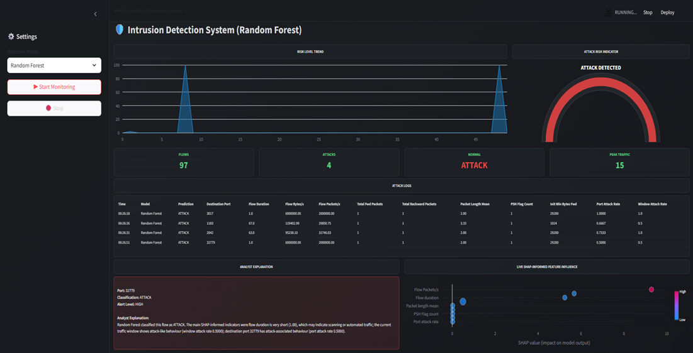

# AI Behavioural Intrusion Detection Dashboard

<p align="center">
  
</p>

---

## Overview

The AI Behavioural Intrusion Detection Dashboard is a machine learning-based cybersecurity monitoring system designed to analyse behavioural network traffic patterns and identify malicious activity in real time.

This project was developed as part of a BSc (Hons) Computing dissertation focused on cybersecurity risk prediction using artificial intelligence and behavioural network traffic analysis.

The proposed system integrates multiple machine learning models, behavioural profiling techniques, explainable AI (SHAP), and a real-time interactive Streamlit dashboard to simulate an enterprise-style intrusion detection environment.

---

## Research Aim

The primary aim of this research is to investigate whether behavioural profiling and machine learning techniques can improve cybersecurity risk prediction and intrusion detection performance within network traffic environments.

---

## Key Features

- Real-time network traffic simulation
- Behavioural anomaly detection
- AI-powered intrusion detection
- Interactive Streamlit dashboard
- Live attack monitoring
- Risk assessment indicators
- SHAP explainability integration
- Behavioural traffic profiling
- Attack logging system
- Multi-model evaluation framework

---

## Machine Learning Models

The system integrates and evaluates multiple machine learning models:

| Model | Purpose |
|---|---|
| Random Forest | Main behavioural intrusion detection model |
| Logistic Regression | Baseline supervised classifier |
| Isolation Forest | Unsupervised anomaly detection |
| 1D CNN | Deep learning behavioural classification |

---

## Explainable AI Integration

The dashboard incorporates SHAP (SHapley Additive exPlanations) to improve transparency and interpretability of model predictions.

This allows analysts to:
- Understand prediction behaviour
- Identify influential network features
- Improve trust in AI-generated decisions
- Support cybersecurity investigation processes

---

## Dataset

This project uses the CICIDS2017 dataset for behavioural network traffic analysis and intrusion detection research.

Dataset characteristics include:
- Benign and attack traffic
- Realistic network flow behaviour
- Multiple attack categories
- Large-scale traffic records
- Behavioural traffic features

---

## Technologies Used

### Programming & Development
- Python
- Streamlit
- Pandas
- NumPy

### Machine Learning & AI
- Scikit-learn
- TensorFlow / Keras
- SHAP

### Visualisation & Dashboard
- Plotly
- Matplotlib
- Seaborn

---

## System Architecture

The proposed system follows the workflow below:

1. Network traffic preprocessing
2. Behavioural feature analysis
3. Data scaling and preparation
4. Machine learning prediction
5. Behavioural anomaly detection
6. SHAP explainability generation
7. Real-time dashboard visualisation

---

## Dashboard Capabilities

The dashboard includes:

- Live prediction monitoring
- Risk score visualisation
- Behavioural attack indicators
- KPI monitoring cards
- Interactive charts and gauges
- SHAP explainability views
- Attack logging table
- Multi-model selection support

---

## Installation

### Clone the Repository

```bash
git clone https://github.com/dorinahabravan/AI-Behavioural-IDS.git
```

### Navigate to the Project Folder

```bash
cd AI-Behavioural-IDS
```

### Install Dependencies

```bash
pip install -r requirements.txt
```

### Run the Dashboard

```bash
streamlit run dashboard.py
```

---

## Repository Structure

```text
AI-Behavioural-IDS/
│
├── dashboard.py
├── README.md
├── requirements.txt
├── alert.mp3
├── streamlit_test_data.csv
│
├── models/
│   ├── rf_under.pkl
│   ├── logistic_under.pkl
│   ├── isolation_under.pkl
│   └── cnn_under.h5
│
├── shap_outputs/
│
├── assets/
│   └── dashboard_preview.png
```

---

## Academic Context

Dissertation Title:

**User Behaviour Profiling for Cybersecurity Risk Prediction Using AI and Network Traffic Analysis**

This project was developed for academic research and educational purposes as part of an undergraduate computing dissertation.

---

## Future Improvements

Potential future enhancements include:

- Real-time packet capture integration
- SIEM platform connectivity
- Cloud deployment
- Advanced deep learning architectures
- Automated incident response
- Threat intelligence integration
- Real-time network streaming support

---

## Author

**Dorina Habravan**

BSc (Hons) Computing  
Cybersecurity & Artificial Intelligence Research

---

## License

This repository is provided for academic and educational purposes.
